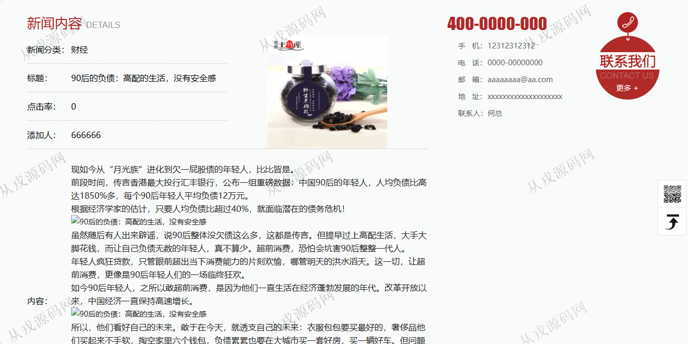
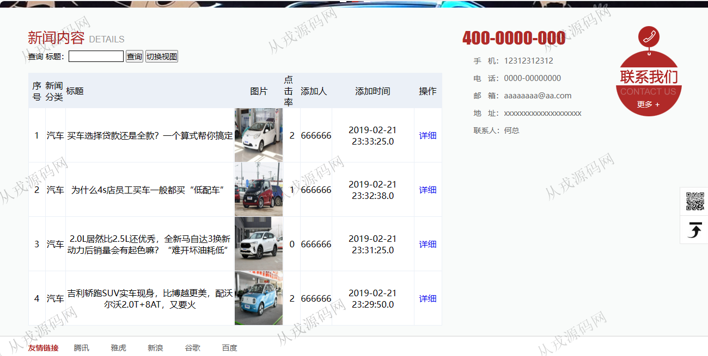
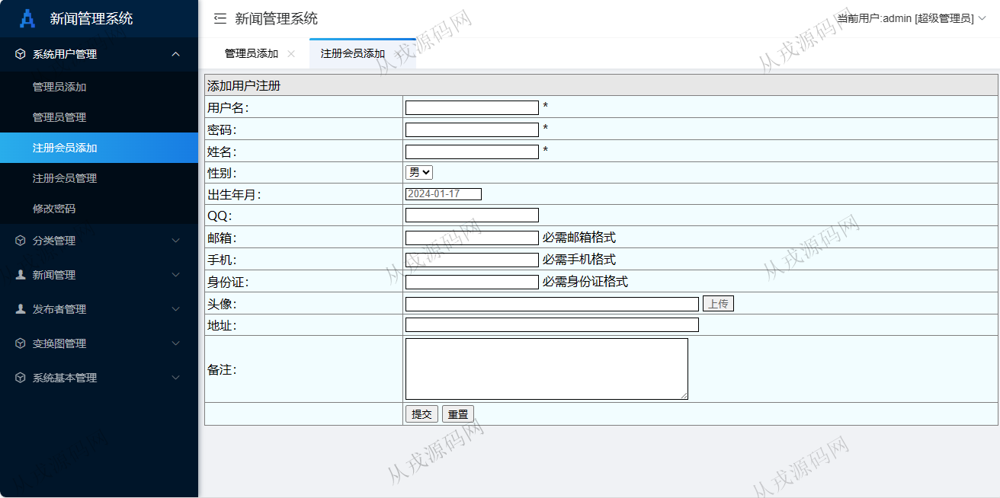
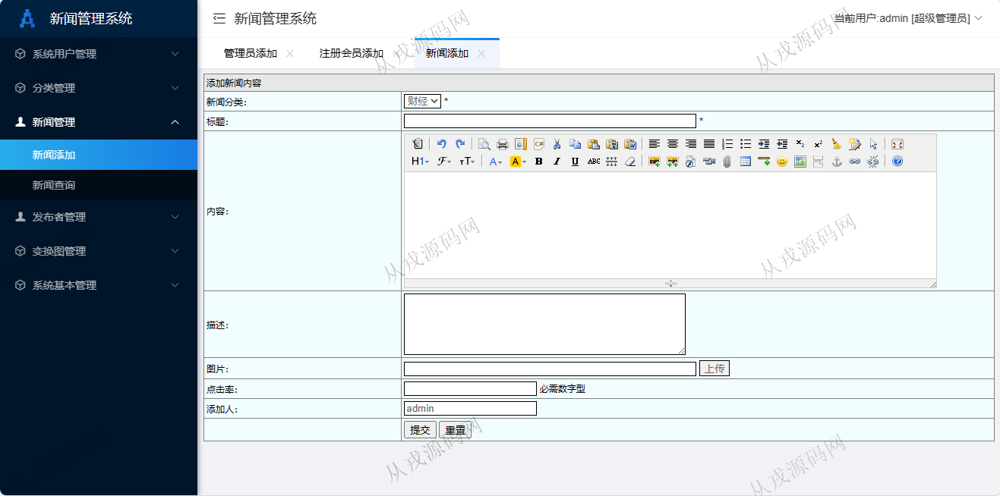
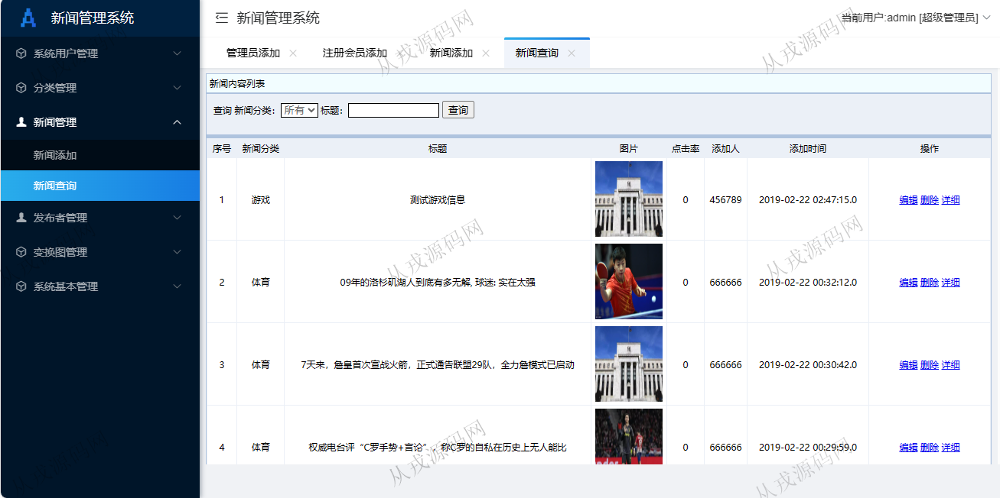
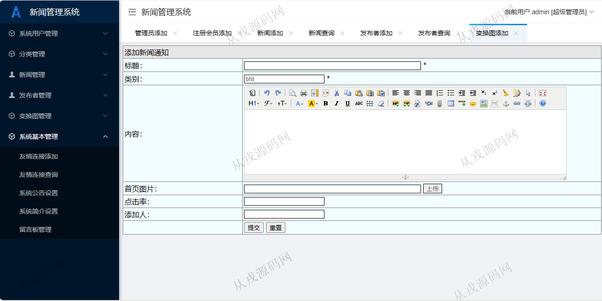

<h1 align="center">161.新闻管理系统</h1>

- <b>完整代码获取地址：从戎源码网 ([https://armycodes.com/](https://armycodes.com/))</b>
- <b>技术探讨、资料分享，请加QQ群：692619798</b> 
- <b>作者微信：19941326836  QQ：952045282</b> 
- <b>承接计算机毕业设计、Java毕业设计、Python毕业设计、深度学习、机器学习</b>
- <b>选题+开题报告+任务书+程序定制+安装调试+论文+答辩ppt 一条龙服务</b>
- <b>所有选题地址 ([https://github.com/YuLin-Coder/AllProjectCatalog](https://github.com/YuLin-Coder/AllProjectCatalog)) </b>

## 项目介绍
基于ssm的新闻管理系统：前端 jsp、jquery，后端 springmvc、spring、mybatis；角色分为管理员、用户；集成财经新闻，汽车新闻，体育新闻，后台发布新闻等功能于一体的系统。

## 功能介绍

### 用户

- 基本功能：登录，注册，退出
- 网站首页：主导航栏，轮播图，财经新闻，汽车新闻，体育新闻，全局搜索
- 新闻：新闻分类列表展示，新闻详情，新闻评论

### 管理员

- 系统用户管理：管理员信息的增删改查，注册会员的增删改查，会员可以由用户在前台自行注册，密码修改
- 分类管理：分类信息的增删改查
- 新闻管理：新闻信息的增删改查，新闻内容支持富文本编辑
- 发布者管理：发布者信息增删改查，发布者可以登录，有发布新闻的权限
- 变换图管理：网站前台大的轮播图设置，图片上传
- 系统基本管理：友情链接添加，友情链接查询，系统公告设置，系统简介设置
- 留言板管理：留言板信息查询和搜索，信息删除，回复

## 环境

- <b>IntelliJ IDEA 2021.3</b>

- <b>Mysql 5.7.26</b>

- <b>Tomcat 7.0.73</b>

- <b>JDK 1.8</b>

## 运行截图

